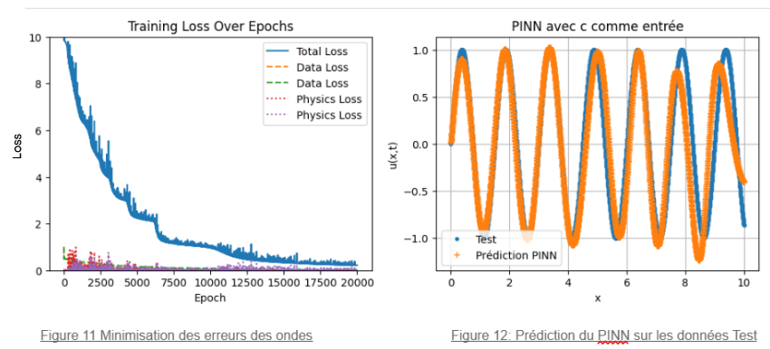

# Introduction
Ce dépôt est créé pour apprendre en pratique les bases de Git et GitHub.   
Dans ce projet, j’ai implémenté un **réseau de neurones PINN (Physics-Informed Neural Network)** appliqué aux équations d’ondes.  

## Image depuis Internet
Voici une illustration d'un réseau PINN :   

## Présentation personnelle
Je développe un projet autour des réseaux de neurones PINN pour modéliser les phénomènes d’ondes.  
Je souhaite apprendre Python, R et Git pour améliorer la reproductibilité de mes analyses et simulations.  
Je suis motivé à comprendre comment gérer efficacement mes projets et collaborer avec d'autres.  
Ce TP me permettra de renforcer mes compétences en versionning, en workflow collaboratif et en applications numériques de l’IA.

## Image locale
Voici un exemple d’image générée localement (par exemple une simulation de propagation d’ondes) :  

## Résumé de l’apprentissage
Durant cette série, j’ai appris à :  
- Créer un dépôt GitHub et le cloner en local  
- Créer et travailler sur une branche  
- Modifier des fichiers, faire des commits et push  
- Ajouter des images en ligne et locales dans un README.md  
- Utiliser VSCode et GitHub Desktop pour gérer mes projets  

**Temps passé : 1,3 h**
